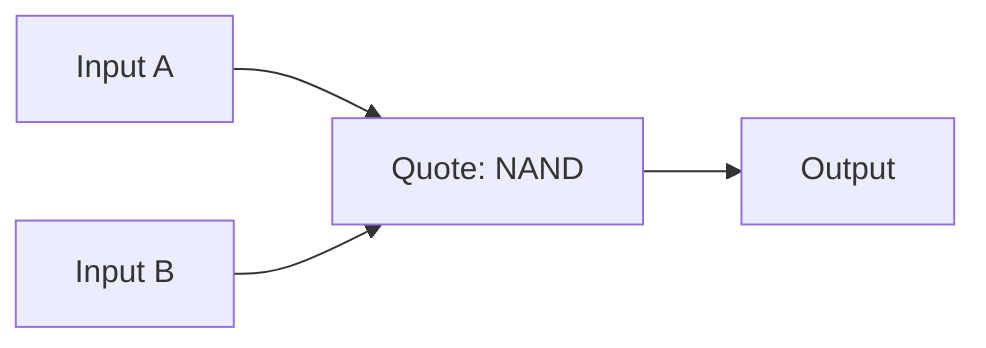
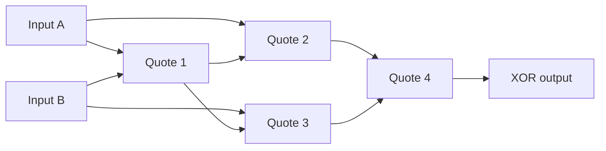
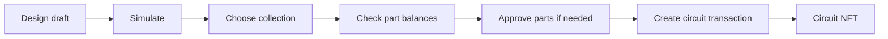

# Build your first FillOut circuit

[Home](README.md) · [Live workspace](https://fillout.work) · [Roadmap](ROADMAP.md)

FillOut connects collectible parts with a visual digital-logic workspace. You can design and simulate a circuit locally, then use parts from your wallet to create a circuit NFT.

## 1. Know the parts

| Element | Editor type | Function | Parts required |
| --- | --- | --- | --- |
| Input | `input` | Supplies a bit, 0 or 1 | None |
| Quote | `nand` | Two-input NAND gate | One Quote per gate |
| Settle | `mem` | One-bit memory | One Settle per memory node |
| Output | `output` | Reads a signal | None |

Quote is part token ID 0; Settle is part token ID 1. OpenBook and FillOut provide the same logical building blocks, but they are separate collections with separate balances and contracts. A circuit must use parts from its selected collection; OpenBook and FillOut balances cannot be combined.

Connections are directed: a source sends a bit to a destination input port. One source can feed multiple ports. Inputs and wires are not extra mintable components.

## 2. Quote: NAND

A Quote outputs 0 only when both inputs are 1.

| A | B | NAND(A, B) |
| --- | --- | --- |
| 0 | 0 | 1 |
| 0 | 1 | 1 |
| 1 | 0 | 1 |
| 1 | 1 | 0 |



Try [example-nand.json](example-nand.json). It requires one Quote and no Settle if you choose to create its NFT.

### NOT with one Quote

Connect the same input to both Quote inputs: NOT(A) = NAND(A, A).
The result is 1 for input 0, and 0 for input 1.
Try [example-not.json](example-not.json).

### XOR with four Quotes

XOR outputs 1 when the two inputs differ. Build:

1. Q1 = NAND(A, B)
2. Q2 = NAND(A, Q1)
3. Q3 = NAND(B, Q1)
4. Output = NAND(Q2, Q3)

| A | B | XOR |
| --- | --- | --- |
| 0 | 0 | 0 |
| 0 | 1 | 1 |
| 1 | 0 | 1 |
| 1 | 1 | 0 |



Try [example-xor.json](example-xor.json). It uses four Quotes and no Settle.

## 3. Settle: one-bit memory

Settle exposes its current stored bit while its input determines the next stored bit. Memory starts at 0. During each engine step:

1. Read the external inputs and current memory.
2. Evaluate NAND gates in dependency order.
3. Read outputs and calculate the next memory values.
4. Use those next values as the memory for the following step.

All memory nodes update together. The engine returns outputs calculated from the old state alongside the next state; it does not repeatedly update memory inside a single step.

For Input → Settle → Output:

| Step | Input | Memory before step / output | Memory after step |
| --- | --- | --- | --- |
| 1 | 1 | 0 | 1 |
| 2 | 0 | 1 | 0 |
| 3 | 0 | 0 | 0 |

Try [example-memory.json](example-memory.json). It uses one Settle and no Quote. A step is a local simulation tick, not a blockchain block or real-world second.

Feedback must pass through a Settle node. A loop made only from Quote gates has no defined evaluation order and is rejected.

## 4. Import, connect and simulate

1. Open an example JSON file above, choose GitHub's raw download option and save it as JSON.
2. Open the Studio on [fillout.work](https://fillout.work) and import the draft.
3. Inspect each connection. Every Quote needs two connected input ports; Settle and Output each need one.
4. Set the input bits and run a simulation step. Compare the output to the relevant table.
5. Export your draft to keep a backup before changing it or creating an NFT.

A saved browser draft is local to the browser. It is not an on-chain NFT and is not a substitute for an exported backup. Importing a draft does not mint parts or submit a transaction.

The editor accepts up to 512 total nodes, with at most 256 inputs and 256 outputs. At least one output is required. All Quote gates are included in compilation, including disconnected-from-output gates, so remove unused gates instead of assuming they are free.

### Common problems

| Problem | What to check |
| --- | --- |
| Connect all input ports | A required wire is missing or refers to a deleted node |
| Cycle detected | Route feedback through memory, or remove the loop |
| Invalid signal source | Use an Input, Quote or Settle as the source; Output is a sink |
| Unsupported draft file | Import a version-1 draft JSON, not encoded netlist hex |
| Wrong memory result | Compare current-state output with next-state memory separately |
| Insufficient parts | Check Quote and Settle balances in the selected collection |

## 5. From a draft to a circuit NFT



Simulation is local. Creating the NFT uses Robinhood Chain mainnet (4663) and requires wallet confirmation and gas.

The recovered circuit contract validates the encoded structure, transfers the required Quote and Settle parts into itself, stores the netlist and mints an ERC-721 circuit NFT. It requires at least one part. An input wired directly to an output may simulate locally but is not enough to mint a circuit.

**Parts are permanently locked when the circuit is created.** The recovered contract provides no dismantle or part-withdrawal operation. Transferring the NFT does not release its parts. The stored circuit design is distinct from your editable browser draft.

Contract validation checks the format and references. It does not prove that a circuit solves a challenge, assign mining power or issue VRAM. See [contract references](docs/contracts.md) and [source status](contracts/README.md); equivalence of recovered source to deployed bytecode remains unverified.

## 6. Draft JSON and encoded netlists

The included examples use `{ "version": 1, "nodes": [...] }`. Nodes have an ID such as `n1`, a type, canvas coordinates and an `ins` array of source IDs. Input nodes also have a `value` of 0 or 1. The order of Input, Settle and Output nodes in the array determines their respective engine ordering.

Compilation resolves connections into an intermediate representation. Encoding produces ACDV version 1 bytes: a header, ordered NAND operations, next-state references and output references. This encoded netlist is used for circuit creation; it is not the draft JSON import format.

Run the example checks locally:

```sh
node verify-examples.mjs
```

These checks validate all example files, NAND/NOT/XOR truth tables, memory transitions and encoded headers using `dist/engine.mjs`. They do not make network requests or send transactions.
